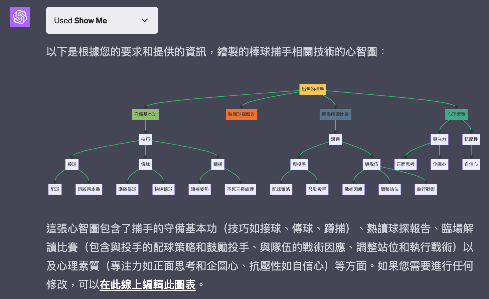
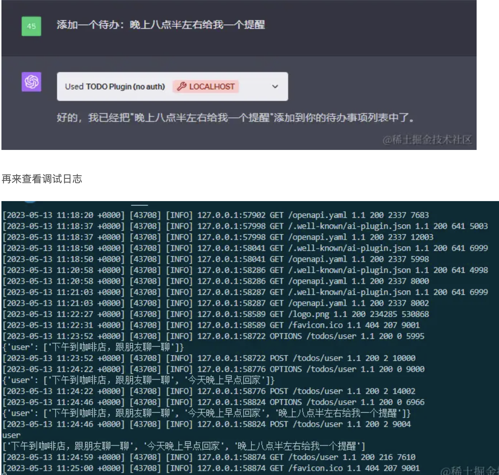

## 前言

最近公司要引入AI平台，需要發想AI如何幫助公司同事提升工作效率，當然也包含教育訓練，讓引入AI變得更加順利。

公司目前要引入的AI平台類似GPT，可以自己客製化機器人並且支援插件，對於實際應用情境來說，肯定是步驟越少、越單純越好。

## 現有AI小幫手整理

根據我的觀察，目前AI小幫手的用途主要有三大類

- 文件知識搜尋

使用情境為使用者有一個明確的目標、答案需要進行查詢、確認

這部分可分為精確搜尋以及AI本身理解

精確理解類似RAG，需要使用者提供資料給AI進行分析、摘要，通常會涉及隱私、近期資料等AI無法用做訓練的資料

例如從公司法規中查詢相關規定、教育訓練等

AI本身理解包括有被作為訓練資料的公開文件等

例如excel公式、python語法、常見公式定義等

- 建議、規劃

使用情境為使用者沒有一個明確的答案，需要AI提供建議、步驟或者方法，讓AI為使用者賦能。

常見的例如協助寫code、重構系統、撰寫郵件等

這類AI產生的結果通常還會需要經過人工的修改、檢查才能被用在工作上

- 為其他工具賦能

目前的AI大多為產生文字，無法很好的整合到現有的工作流程當中，如果能夠提供一種方法讓AI產生的結果與現有工具直接互動的話，可以提升效率，節省複製貼上、消化AI結果的時間。

通常為複雜任務，沒辦法一步到位，或者對結果有著嚴格要求。

常見工具為：文生圖、文字生成簡報、文字生成音樂、文字生成影片、與現有API進行串接

這類AI產生的結果通常為業務最後的結果，中間為黑盒子，使用者不需去調整或了解，只需關注結果。

## 可能的AI小幫手

可以根據業務需求，分別開發對應的AI小幫手

### 客服

- **工作內容**

1.接聽投資人基金產品諮詢、開戶及軟體使用操作來電
2.接待及服務現場投資人基金產品諮詢、開戶及軟體操作
3.處理客戶意見
4.回訪客戶盡職調查
5.處理產品交易相關文件

- 特質

抗壓性高、主動積極、表達力強、耐心與責任感

- 可能的小幫手

基金產品說明書、軟體操作文檔→文件搜尋小幫手

處理客戶意見、回訪客戶→客服訓練小幫手

壓力大→心理諮商小幫手

### 基金事務部

- 工作內容
1. 負責受益人基本資料維護作業
2. 負責基金申贖交易及收益分配作業
3. 一般事務性工作及不定期專案任務支援
- 特質

細心負責、團隊精神、反應靈敏

- 可能的小幫手

事務型工作、數據分析工具→Excel公式小幫手

資料庫管理系統→SQL小幫手

資料、報告準備→簡報小幫手（？）

基金相關問題、法規、內部合規要求、資料庫相關文件、公司例行事務執行→文件搜尋小幫手

市場資訊、新聞資訊→新聞快報小幫手

### 通路

- 工作內容
1. 基金銷售通路開發經營與關係維護
2. 對銷售機構舉辦客說會、專案活動洽商與執行及客戶陪訪
3. 負責基金銷售業務
4. 市場及同業資訊回報
- 特質

抗壓性高、良好溝通能力及公開演說能力

- 可能的小幫手

產品推廣、銷售話術→推銷訓練小幫手

合同起草、產品培訓→潤稿、文件撰寫小幫手

常用軟體串接？？

## AI使用說明

1. 如果你的AI開始出現幻覺或者鬼打牆，代表AI學壞了，請重開一個新的聊天，將AI的記憶洗掉
2. 如果要上傳文件，請盡量先轉成文字檔，或者圖片，一次盡可能不要超過10MB。這可以幫助AI更好的理解內容並且節省你的使用額度
3. 使用提示詞(prompt)時，盡可能描述清楚，如果不知道該如何下提示詞，可以參考模板或者詢問AI，讓AI根據需求產生適當的提示詞
4. 不要重複貼上一樣的對話內容，沒有新的資訊給AI，AI只會道歉並回覆同樣的回應並且消耗你的使用額度
5. 如果你的任務很複雜，請諮詢有資訊能力的同事協助製作對應的插件(plugin)

提示詞模板有幾個原則可以參考

- 指定角色：你是一個excel專家
- 給予明確的任務：請生成計算目前日期的函數
- 提供脈絡：我現在在製作每日的記帳資料
- 提供範例：請根據以下資料a,b,c生成對應的假資料
- 建立規則和限制：請你使用json或code block的格式提供結果/字數請不要超過800個字
- 多輪對話、評估、迭代：AI或許無法一下子理解需求，透過一步步的引導與確認需求可以讓AI產生品質更高的回應

## 補充：AI插件（以GPT為例）

如果只能問文字內容的話也太單調，使用會受到限制，但是透過插件就可以讓AI變得更強大，創造不同的使用體驗

- 網頁摘要插件**WebPilot**
- 提供簡報主題及大綱，自動生成簡報架構檔案**Smart Slides**
- 產生圖表、流程圖、心智圖**Showme**

### 達哥插件

插件可以透過API進行資料獲取、操作等功能

理論上可以做到的有

- 網頁摘要
- API資料搜尋、問答
- 公司內部系統串接：打卡、請假、分機查詢等等，因為是在公司內部使用，一些不需要身份資料的查詢應該可以直接整合？
- 不過外部插件還是需要注意會不會將資料傳給第三方網站，不確定這部分會怎麼進行判定？

# 參考資料

https://juejin.cn/post/7232625387297194040