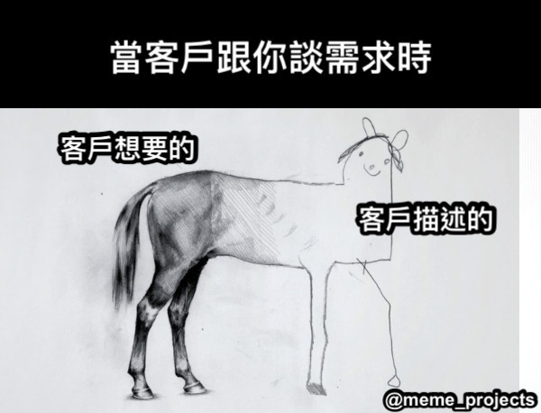
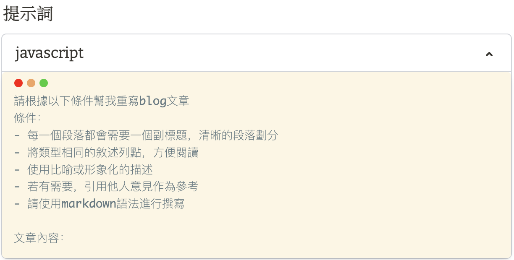

# AI運用
情境想像：

核心觀念：AI不會通靈，需要給足夠多的提示及引導才能產出較佳的輸出。不要求AI一次產生到位，可以分成多個步驟進行生成。
提問原則：應避免提問模糊、廣泛以及引導性不足。以清晰的指令、關鍵的上下文引導AI產生對應的結果

# AI歌曲
類型
AI翻唱
音樂生成
單曲生成
AI主唱
歌詞創作
https://studio.yating.tw/music
- yating：提供上述多種AI功能
- suno AI：生成有人聲的音樂
先產生歌詞、選擇音樂風格、生成適合的封面圖像
- MyEdit：生成AI音效
- Stable Audio：生成純音樂
- Sounddraw：生成主題配樂
- covers.ai：AI翻唱工具

# AI短影片
類型
自動化完成流程：上字幕、剪輯、精簡、配音
大量內容產生：腳本、圖片、音樂、文字轉影片

- 威力導演：AI動畫生成，可以將影片轉成AI動畫風格、自動上字幕、文字轉語音(Azure?)、AI人物特效、素材生成器、變聲器、自動馬賽克
免費版會有浮水印
- Flexclip：生成快，但是不精確
- Pictory：輸入完整的影片腳本，AI自動分割成幕，搭配上對應的影片素材和音樂（長篇變成短篇，讓AI生成長篇，再精簡）
目前只支援英文
- Synthesia：虛擬主播，輸入文字並選擇對應的人像和聲音，就能產生虛擬主播念稿影片
- stableVedio：將靜態圖片轉成動態圖片

# AI簡報
- Gamma:根據簡報的大綱產生出簡報，可以自己選擇合適的風格和圖像，可以匯出為ppt再做編輯。也可以輸入檔案讓Gamma美化

1. 輸入標題卡片
2. 選擇想要的視覺設計
3. 手動或自動微調草稿
或
1. 請專門的AI產生對應的簡報大綱（如Claude）
2. 將內容貼到Gamma產生簡報
3. 手動或自動調整草稿

AI產生簡報的好處
1. 省下版面配置的心力
2. 簡報內容架構明確

其他類似的AI
- Wepik
- Tome(故事化簡報)，免費額度有限

# 短文介紹
